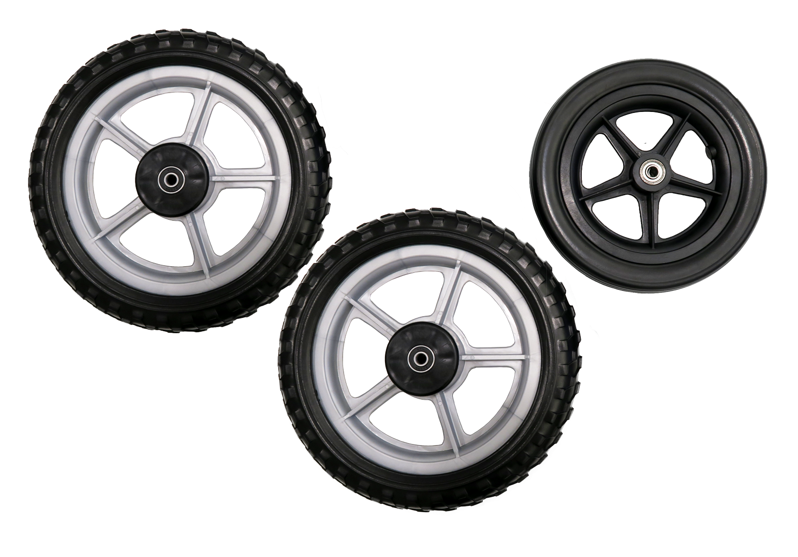

---
# You don't need to edit this file, it's empty on purpose.
# Edit theme's home layout instead if you wanna make some changes
# See: https://jekyllrb.com/docs/themes/#overriding-theme-defaults
layout: default
---
<header>
    

        

            <h1></h1>
            <ul class="sub-links">
                <li><a class="link smooth" href="#team">Team</a></li>
                <li><a class="link" href="http://www.tauber.umich.edu/form/ipd-voting" target="_blank">Link to IPD Home</a></li>
            </ul>
        

        
        <nav class="main-nav">
            <ul class="nav-items">
                <li class="nav-item"><a class="smooth" href="#product">Product</a></li>
                <li class="nav-item"><a class="smooth" href="#features">Features</a></li>
                <li class="nav-item"><a class="smooth" href="#video">Video</a></li>
            </ul>
        </nav>
        <svg class="shape" width="1440px" height="397px" viewBox="0 0 1440 397" version="1.1" xmlns="http://www.w3.org/2000/svg" xmlns:xlink="http://www.w3.org/1999/xlink">
            <g id="Web-show" stroke="none" stroke-width="1" fill="none" fill-rule="evenodd">
                <g transform="translate(0.000000, -608.000000)" fill="#D9660B">
                    <polygon id="Rectangle" points="0 608 1440 772.201384 1440 898.454403 0 1005"></polygon>
                </g>
            </g>
        </svg>
    

    

        

            <h1></h1>
            <button type="button" class="nav-burger">
                
                
                
            </button>
            <ul class="fixed-nav-items">
                <li class="fixed-nav-item"><a class="smooth" href="#product">Product</a></li>
                <li class="fixed-nav-item"><a class="smooth" href="#features">Features</a></li>
                <li class="fixed-nav-item"><a class="smooth" href="#video">Video</a></li>
                <li class="fixed-nav-item"><a class="smooth" href="#team">Team</a></li>
                <li class="fixed-nav-item"><a href="http://www.tauber.umich.edu/form/ipd-voting" target="_blank">Link to IPD Home</a></li>
            </ul>
        

    

</header>

<main>
    

        <section class="section section-intro" id="product">
            

                
            

            <h4 class="intro-heading">STABLE— wheels that protect you</h4>
            
Do you or a loved one use a walker? Are you or they ready to become more mobile? Try STABLE! These are wheels with enhanced safety features that can be easily attached to your current walker.  STABLE is our solution to improving the experience of using rollators currently on the market.

        </section>
    

    <section class="section section-how">
        

            

                <h4 class="how-heading">How it works:</h4>
                

                    
1

                    
<strong>Enter your walker information</strong>  Our selections of wheels are customized to fit most common walkers in the market.

                

                

                    
2

                    
<strong>Get your new STABLE wheels</strong>  The wheels will be delivered to your door together with an installation kit.

                

                

                    
3

                    
<strong>Easily install STABLE to your walker</strong>  STABLE wheels are made so that you can install them yourself. We also provide installation service at a fee.

                

            

            

        

    </section>
    <section class="section grey" id="features">
        

            <h2 class="section-heading">Features</h2>
            

                

                    <svg class="feature-icon" viewBox="0 0 42 60" version="1.1" xmlns="http://www.w3.org/2000/svg" xmlns:xlink="http://www.w3.org/1999/xlink">
                        <g stroke="none" stroke-width="1" fill="none" fill-rule="evenodd">
                            <g transform="translate(0.000000, 1.000000)" fill="#D9660B" fill-rule="nonzero">
                                <path d="M20.3353795,0 C15.7787478,0 11.709905,2.11126176 9,5.33040076 L9.83586696,6.02309944 C12.3521215,3.03401208 16.119174,1.08128573 20.3353795,1.08128573 C24.5515849,1.08128573 28.3186374,3.03401208 30.834892,6.02309944 L31.6707589,5.33040076 C28.960854,2.11126176 24.8920111,0 20.3353795,0 Z M20.3353795,4.32514293 C16.9623221,4.32514293 13.9129817,5.84466026 11.9852391,8.32083162 L12.8552231,8.97974012 C14.5754905,6.77005162 17.2925563,5.40642867 20.3353795,5.40642867 C23.3782027,5.40642867 26.0952684,6.77005162 27.8155358,8.97974012 L28.6855198,8.32083162 C26.7577772,5.84466026 23.7084369,4.32514293 20.3353795,4.32514293 Z M20.3353795,8.65028587 C18.105267,8.65028587 16.0726597,9.85074281 14.961949,11.598479 L15.8831085,12.1813596 C16.7918633,10.7513862 18.509016,9.7315716 20.3353795,9.7315716 C22.1617429,9.7315716 23.8788956,10.7513862 24.7876504,12.1813596 L25.7088099,11.598479 C24.5980993,9.85074281 22.5654919,8.65028587 20.3353795,8.65028587 Z" id="Shape" stroke="#D9660B" stroke-width="2"></path>
                                <path d="M40.5938163,25.9132514 L29.1800073,37.3168147 C29.6513136,38.3721309 29.9074583,39.5299051 29.9074583,40.7593998 C29.9074583,45.4611924 26.0960248,49.2736505 21.3932076,49.2736505 C16.6903904,49.2736505 12.8789569,45.4611924 12.8789569,40.7593998 C12.8789569,36.0565826 16.6903904,32.2451491 21.3932076,32.2451491 C22.6227023,32.2451491 23.7804764,32.5012938 24.8357927,32.9623543 L31.7517003,26.0464467 C24.8357927,21.466579 15.399421,22.2247674 9.3134223,28.3107661 C5.9528035,31.6713849 4.0983157,36.1487947 4.0983157,40.9028408 C4.0983157,45.6568869 5.9528035,50.1342968 9.3134223,53.4959401 C10.1125938,54.2940871 10.1125938,55.5963269 9.3134223,56.3954984 C8.9138365,56.7950842 8.3913013,57 7.868766,57 C7.335985,57 6.8134498,56.7950842 6.413864,56.3954984 C2.2745652,52.2561997 0,46.7542109 0,40.9028408 C0,35.0524953 2.2745652,29.5505065 6.413864,25.4112078 C14.1084516,17.7166202 26.1370079,16.948186 34.6932664,23.1059052 L36.2403805,21.5587911 C37.4493836,20.3600338 39.3848132,20.3600338 40.5948408,21.5587911 C41.7925736,22.7677942 41.7925736,24.7144941 40.5938163,25.9132514 Z" id="Shape"></path>
                            </g>
                        </g>
                    </svg>
                    <h3 class="feature-heading">Detect sudden acceleration</h3>
                    
Our active technology detects sudden jerking-forward movements.

                

                

                    <svg class="feature-icon" viewBox="0 0 42 60" version="1.1" xmlns="http://www.w3.org/2000/svg" xmlns:xlink="http://www.w3.org/1999/xlink">
                        <g stroke="none" stroke-width="1" fill="none" fill-rule="evenodd">
                            <g fill="#D9660B">
                                <path d="M23,35.6627907 C23.5836576,36.0116279 23.9922179,36.4767442 24.3424125,37 L38,37 C37.0077821,29.2674419 30.8210117,23.1046512 23.0583658,22 L23,35.6627907 Z M17.7743191,41 L4,41 C5.10894942,48.8235294 11.2957198,54.9411765 19,56 L19,42.2352941 C18.5330739,41.8823529 18.1245136,41.4705882 17.7743191,41 Z M4,37 L17.6046512,37 C17.9534884,36.4767442 18.4767442,35.9534884 19,35.6046512 L19,22 C11.2093023,23.0465116 5.04651163,29.2093023 4,37 Z M24.171875,41 C23.8203125,41.4705882 23.46875,41.8235294 23,42.1764706 L23,56 C30.734375,54.8823529 36.828125,48.7647059 38,41 L24.171875,41 Z M21,18 C32.6299213,18 42,27.4251969 42,39 C42,50.6299213 32.6299213,60 21,60 C9.42519685,60 0,50.6299213 0,39 C0,27.4251969 9.42519685,18 21,18 Z" id="Shape"></path>
                                <path d="M29.084836,3.58471437 C29.0823488,3.58471437 29.0798616,3.58533618 29.078618,3.58533618 L25.0113818,3.58533618 L18.6490578,3.58533618 C17.8711779,1.49295737 15.8621212,0 13.4992565,0 C10.4617319,0 8,2.46173187 8,5.49925654 C8,8.53678121 10.4617319,10.9985131 13.4992565,10.9985131 C15.8621212,10.9985131 17.8711779,9.50555571 18.6490578,7.4137987 L19.0638028,7.4137987 L22.2026819,7.4137987 L23.8193787,9.02863013 L25.434832,7.4137987 L27.0502852,9.02863013 L28.6657385,7.4137987 L29.0860796,7.4137987 C30.1425289,7.4137987 31,6.55694936 31,5.49925654 C31,4.44156371 30.1419071,3.58471437 29.084836,3.58471437 Z M13.4992565,7.97466814 C12.1325259,7.97466814 11.0238449,6.86598719 11.0238449,5.49925654 C11.0238449,4.13252589 12.1325259,3.02384493 13.4992565,3.02384493 C14.8659872,3.02384493 15.9746681,4.13252589 15.9746681,5.49925654 C15.9746681,6.86598719 14.8659872,7.97466814 13.4992565,7.97466814 Z" id="Shape" fill-rule="nonzero"></path>
                            </g>
                        </g>
                    </svg>
                    <h3 class="feature-heading">Engage auto-locking</h3>
                    
The auto-locking is engaged, preventing your walker to skid forward.

                

                

                    <svg class="feature-icon" viewBox="0 -20 44 60" version="1.1" xmlns="http://www.w3.org/2000/svg" xmlns:xlink="http://www.w3.org/1999/xlink">
                        <g stroke="none" stroke-width="1" fill="none" fill-rule="evenodd">
                            <g fill="#D9660B" fill-rule="nonzero">
                                <g id="Group">
                                    <path d="M26.4,13.125 L17.6,13.125 C16.3849736,13.125 15.4,12.159614 15.4,10.96875 L15.4,2.34375 C15.4,1.15288601 16.3849736,0.1875 17.6,0.1875 L26.4,0.1875 C27.6150264,0.1875 28.6,1.15288601 28.6,2.34375 L28.6,10.96875 C28.6,12.159614 27.6150264,13.125 26.4,13.125 Z M19.8,8.8125 L24.2,8.8125 L24.2,4.5 L19.8,4.5 L19.8,8.8125 Z" id="Shape"></path>
                                    <path d="M22,39 C20.7849736,39 19.8,38.034614 19.8,36.84375 L19.8,10.96875 C19.8,9.77788601 20.7849736,8.8125 22,8.8125 C23.2150264,8.8125 24.2,9.77788601 24.2,10.96875 L24.2,36.84375 C24.2,38.034614 23.2150264,39 22,39 Z" id="Shape"></path>
                                    <path d="M2.2,39 C1.36670147,39 0.604922611,38.5385574 0.23226018,37.8080543 C-0.140402251,37.0775513 -0.0599791172,36.2033818 0.44,35.55 L20.24,9.675 C20.7115906,9.05871686 21.4828123,8.73583511 22.2631535,8.82798118 C23.0434947,8.92012725 23.7144029,9.41330196 24.0231535,10.1217312 C24.3319041,10.8301604 24.2315906,11.6462169 23.76,12.2625 L3.96,38.1375 C3.54452036,38.6804563 2.89246607,39 2.2,39 Z" id="Shape"></path>
                                    <path d="M41.8,39 C41.1075339,39 40.4554796,38.6804563 40.04,38.1375 L20.24,12.2625 C19.5109841,11.3098088 19.7079788,9.9582684 20.68,9.24375 C21.6520212,8.5292316 23.0309841,8.72230881 23.76,9.675 L43.56,35.55 C44.0599791,36.2033818 44.1404023,37.0775513 43.7677398,37.8080543 C43.3950774,38.5385574 42.6332985,39 41.8,39 Z" id="Shape"></path>
                                </g>
                            </g>
                        </g>
                    </svg>
                    <h3 class="feature-heading">Provide stable support</h3>
                    
Wheels are automatically locked within 15 seconds of inactivity.

                

            

        

    </section>
    <section class="section" id="video">
        <h2 class="section-heading">Video</h2>
    </section>
    <section class="section" id="team">
        

            <h2 class="section-heading">Team</h2>
            

                <a class="member" target="_blank" href="https://www.linkedin.com/in/huyenttphan/">
                    
                    <h3 class="member-name">Huyen Phan</h3>
                    
Product Designer

                </a>
                <a class="member" target="_blank" href="https://www.linkedin.com/in/holly-meers-7a6409a2/">
                    
                    <h3 class="member-name">Holly Meers</h3>
                    
Product Designer

                </a>
                

                    
                    <h3 class="member-name">Srinivas Dustker</h3>
                    
Product Engineer

                

                

                    
                    <h3 class="member-name">Jyoty Subramanian</h3>
                    
Product Manager

                

                <a class="member" target="_blank" href="https://www.linkedin.com/in/brok-hsu-4a4387a5/">
                    
                    <h3 class="member-name">Brok Hsu</h3>
                    
Product Strategist

                </a>
            

        

    </section>
</main>

<footer class="footer">
    <small class="copyright">Team Lily | IPD Winter 2018</small>
</footer>

    

